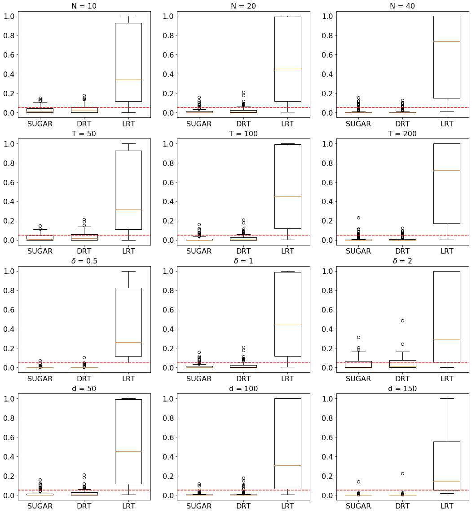
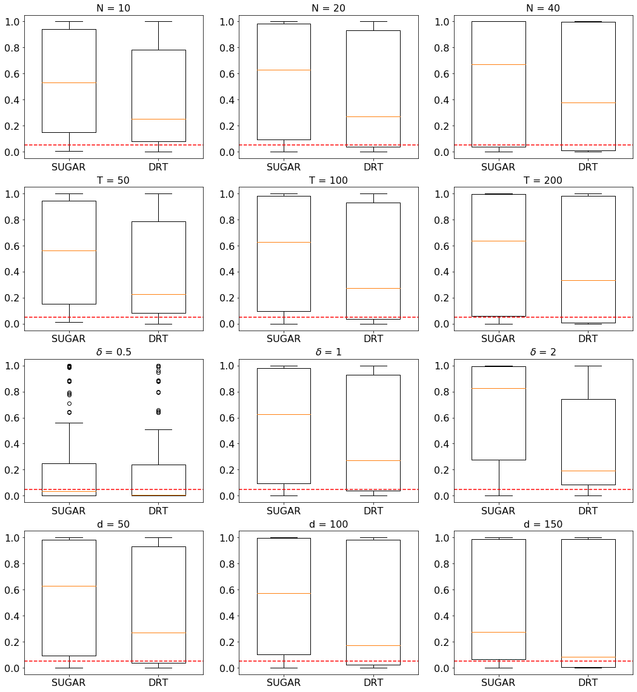

# Testing Directed Acyclic Graph via Structural, Supervised and Generative Adversarial Learning

This repository contains the implementation for the paper "Testing Directed Acyclic Graph via Structural, Supervised and Generative Adversarial Learning
" in Python. 

## Summary of the paper

In this article, we propose a new hypothesis testing method for directed acyclic graph (DAG). While there is a rich class of DAG estimation methods, there is a relative paucity of DAG inference solutions. Moreover, the existing methods often impose some specific model structures such as linear models or additive models, and assume independent data observations. Our proposed test instead allows the associations among the random variables to be nonlinear and the data to be time-dependent. We build the test based on some highly flexible neural networks learners. We establish the asymptotic guarantees of the test, while allowing either the number of subjects or the number of time points for each subject to diverge to infinity. We demonstrate the efficacy of the test through simulations and a brain connectivity network analysis.   

**Figures**:  

| Size | Power | Power Difference |
| :-------:    |  :-------: |  :-------: |
|    |   |   

## Requirement

+ Python 3.6
    + numpy 1.18.5
    + scipy 1.5.4
    + torch 1.0.0
    + tensorflow 2.1.3
    + tensorflow-probability 0.8.0
    + sklearn 0.23.2
    + igraph 0.10.0

+ R 3.6.3
    + clrdag (https://github.com/chunlinli/clrdag)

## File Overview
- `src/`: This folder contains all python codes used in numerical simulations and real data analysis.
  - `main.py` is the main function to reproduce the simulation results in section 5 of the paper.
  - `main_real.py` is the main function to implements the real data analysis in section 6 of the paper.
  - `main_lrt.R` is to implement the methods in ["Likelihood ratio tests for a large directed acyclic graph"](https://www.ncbi.nlm.nih.gov/pmc/articles/PMC7508303/)
  - `nonlinear_learning.py` is used for structural learning of the graphs. (Refers to https://github.com/xunzheng/notears)
  - 'inference.py' contains the helper functions for p value calculation in simulations.
  - `infer_utils.py` contains the major functions to implement DAG structure learning and p value calculation for simulations.
  - `real_utils.py` contains the major functions to implement DAG structure learning and p value calculation for the real data analysis.
  - `sim_gen.py` contains the utils functions to generate data for simulations and is sourced to implement the LRT.
  - `plot.py` contains the functions to load test results and draw plots for the simulations.
  - `utils_tools.py` provides the helper function for the GAN with Sinkhorn divergence.
  - `utils.py` provides the other utility functions.
- `data/`: This folder where the output results and the dataset should be put.
  - `module_name.npy` records the information of the electrode names. 
  - `data_process.R` implements the preprocessing of the raw real dataset.

## Workflow

- Follow the steps below in order to reproduce the simulations of this paper:
    -  Navigate to the `src` folder
    -  Run `main.py` to implement SUGAR and DRT for the simulations.
    -  Run `main_lrt.R` to implement LRT for the simulations.
    -  Run `plot.py` to reproduce the figures of sensivity analysis in seciton 5 of the paper.

- We also provide a toy example in `scr/example.ipynb` which is feasible to run on a local computer and reproduce the case of $\delta=0.5$ in Figure 2 of the main paper.

- Follow the steps below in order to reproduce the real data analysis of this paper:
    -  Put the HCP data into the "data" folder. This data can be requested at https://www.humanconnectome.org/study/hcp-young-adult after signing the data user agreement.
    -  Navigate to the `data` folder and run `data_process.R` to preprocess the dataset.
    -  Navigate to the `src` folder and run `main_real.py` to implement the DAG testing for HCP data.

